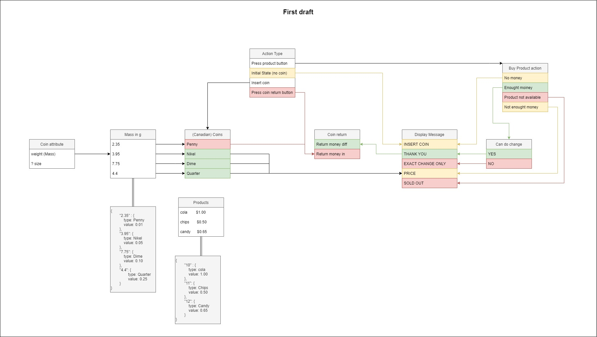
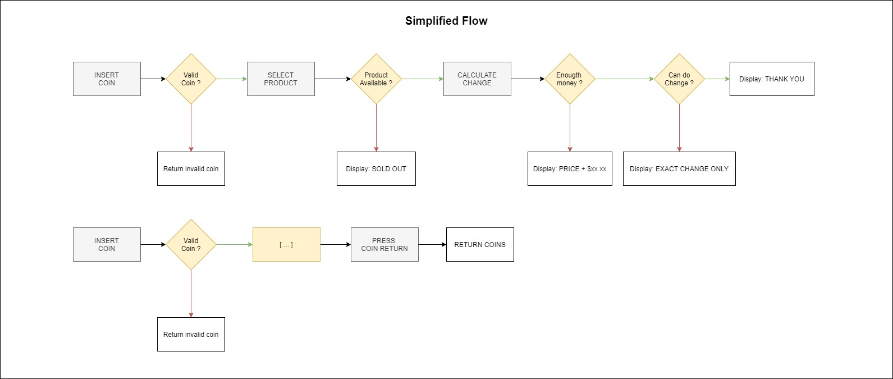

# Documentation vending machine kata for keyprod

## Process :

1. Extract data from subject
2. Draw a first draft of the flow
3. Draw a simplified worflow that will give you a flow for each user action (will help for developpement)
4. Find out what is missing in the suject to organize your code or objects and avoid dead-ends

## First draft :

## Simplified Fllow :

## What is missing or confusing :

1. The defintion of coins. I've choosed to use Canadian coins and their values. This is a personal choice to have consistence in datas and what can affect the machine. An object of coin based on their weight will be implemented. The use of teh size of the coin should be a second criteria to valid the coin and avoid money falcification.
   1. [https://en.wikipedia.org/wiki/Quarter_(Canadian_coin)]()
   2. [https://en.wikipedia.org/wiki/Dime_(Canadian_coin)]()
   3. [https://en.wikipedia.org/wiki/Nickel_(Canadian_coin)]()
2. I've found out that we have no information about products, so the idear is to have a list of product. This list of product should be static and so being a constant object. Empty at first it can be updated throught a csv file of product, an api (would be the best) or throug a script.
3. Another question is the index of a product in the machine it can be selected by the user. The products will have for index a 2 digit number. Those digit will be incremental. Under 10, we will have a leading 0 in front of the second digit in order to wait for a 2 digit selection from the user. This incrementation keep a simple implementation through a loop. It could be easely changed if we would use the id of the product instead in the future.
4. So far, we have no indication about how the user will select a product and validate it. So, we will assume that a validation button can be hitten to send the selection to the machine. In this case, both ways arez available :
   1. a correct product digit is selected and everything is going well
   2. an inccorrect digit is writen and we have to give an implementation not defined in the subject.
5. We also have no indication of how many coins of each type is already in the machine. This data is important to find out if we have enought cash for coin return. Knowning that, we will assume that the user should provide the exact amout in any case and is not waiting for the change.

---

I've spent around 2 hours to read the subject, extract datas, draw the above schemas and writte this bunch of information.

Next step is writting the programm

## pre-request

1. NodeJS v18.17.1
2. NPM v9.6.7
3. Express v4.18.2
4. Playwright `npm init playwright@latest`

## Configuration playwright

1. Tests end-to-end dans le dossier: tests.
2. Ajout de githubactions workflow: no
3. Install Playwright browsers (can be done manually via 'npx playwright install') ? Yes

Run test with command :  `npx playwright test --ui`

## Start Server

Execute command `node index.js` in projet root folder

Access app at [http://localhost:5000/ ]()

## Dev command

1. `npx tsc` pour une compilation manuelle
2. `npx tsc --watch` pour une compilation à la saisie

## What's left

1. In this programm we have a full implementation of functionnality for the machine, but the design is a little bit rude. 1 or 2 hour should be enought to have a nice and colorfull design.
2. We could add the ability to manage coins change when adding more money than needed to buy a product. It means having a coin  storage managment and calculate if we have enougth coin to do the change. Furthermore, we would have to say witch kind of coin we be given to the user. It should probably take a day with the tests
3. Talking about test, their's none here but it should be implemented. The current architecture in module will help to add them using jest
4. Coins available and products could be added throught an API or an excel stylesheet.
